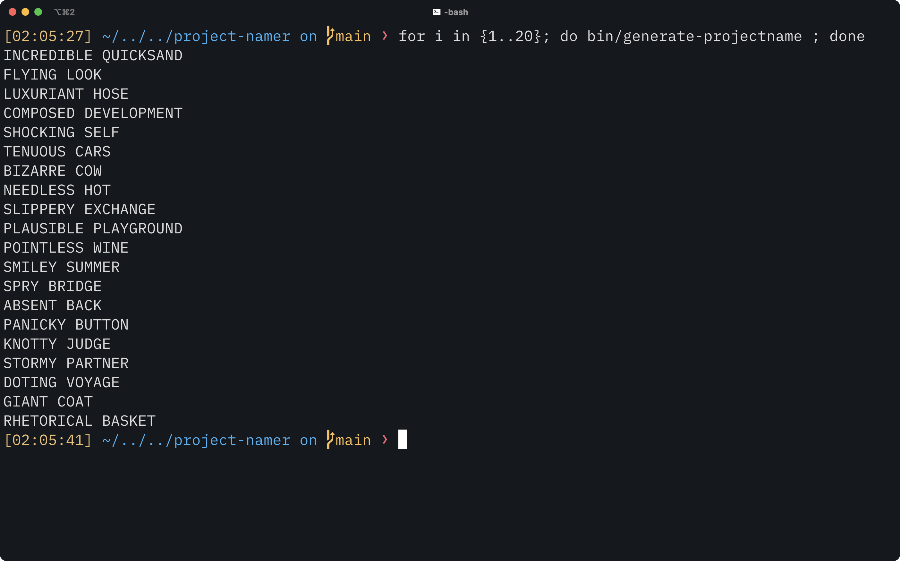

# project-namer

Make your own project names that sound like they were created for [top-secret military nuclear detonation monitoring](https://en.wikipedia.org/wiki/Boeing_WC-135_Constant_Phoenix), or by an [aeronautics firm's classified skunk works](https://en.wikipedia.org/wiki/Lockheed_Have_Blue).

Just run the command to have it output two words for you to bootstrap your own super-sekrit project.

```bash
bin/generate-projectname
```

By editing the `adjectives.txt` and `nouns.txt` files in the `etc` directory, you can change the names that are randomly generated. Adjectives are always the first word, nouns are always the second.

<p align="center"></p>

Based on [Akash K](https://github.com/aceakash)'s [Project Name Generator](https://github.com/aceakash/project-name-generator).